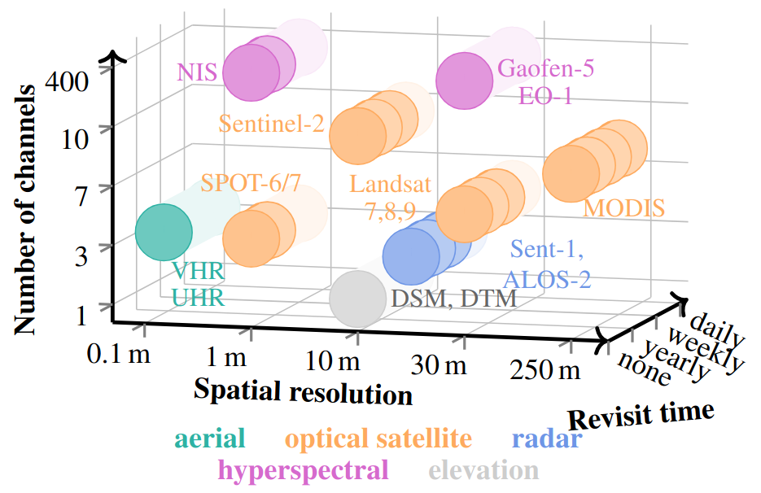
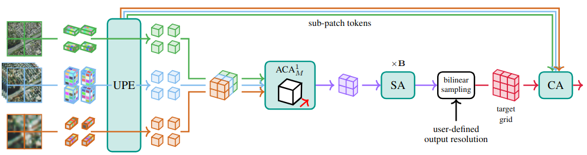
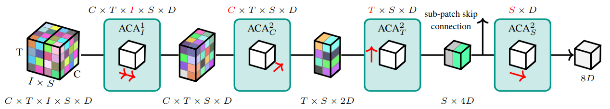
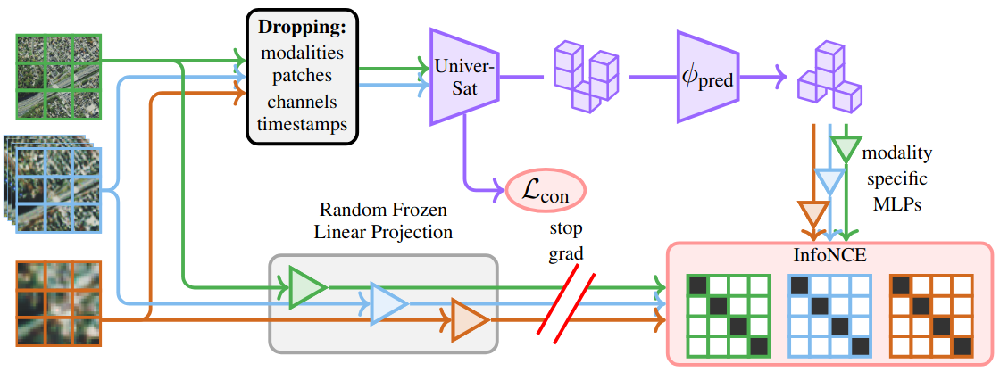
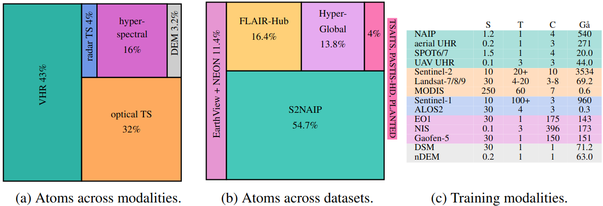
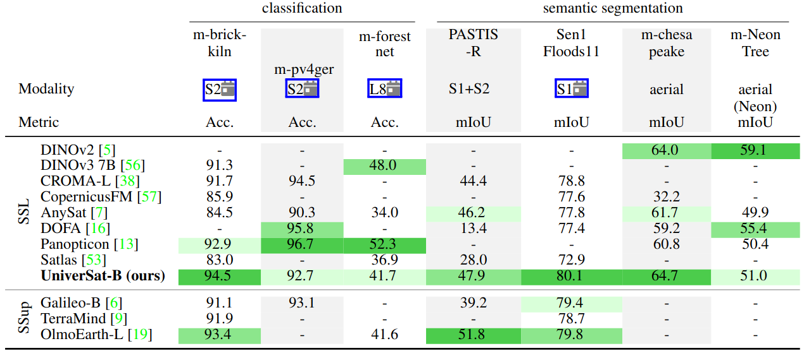
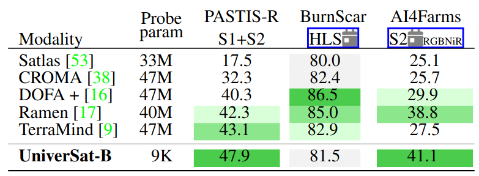
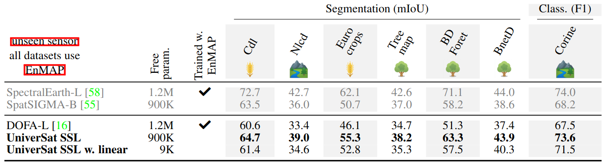
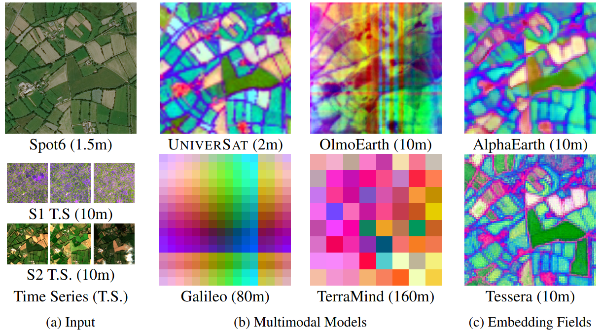

# UniverSat

### Resolution- and Modality-Agnostic Transformers for Earth Observation

[](https://arxiv.org/abs/2606.23503)
[](https://gastruc.github.io/universat)
[](https://www.python.org/)
[](https://pytorch.org/get-started/locally/)
[](https://pytorchlightning.ai/)
[](https://hydra.cc/)
[](LICENSE)

**[Yohann Perron](https://yohannperron.github.io/WebPage/)\*** · **[Guillaume Astruc](https://gastruc.github.io/)\*** · **[Nicolas Gonthier](https://ngonthier.github.io/)** · **[Clément Mallet](https://www.umr-lastig.fr/clement-mallet/)** · **[Loïc Landrieu](https://loiclandrieu.com/)**

<sup>\*</sup>Equal contribution &nbsp;·&nbsp; LASTIG, Univ Gustave Eiffel &nbsp;·&nbsp; IGN &nbsp;·&nbsp; ENSG &nbsp;·&nbsp; CNES &nbsp;·&nbsp; LIGM, École des Ponts ParisTech &nbsp;·&nbsp; EFEO

<p align="center">
  <a href="https://gastruc.github.io/universat"><b>🌐 Project page</b></a> &nbsp;·&nbsp;
  <a href="https://arxiv.org/abs/2606.23503"><b>📄 Paper</b></a> &nbsp;·&nbsp;
  <a href="#quick-start"><b>⚡ Quick Start</b></a> &nbsp;·&nbsp;
  <a href="demo.ipynb"><b>📓 Demo</b></a>
</p>

<p align="center">
  
  <br>
  <sub><b>One UniverSat</b>, trained jointly on <b>13 sensors from 7 datasets</b> spanning ~3 orders of magnitude in spatial resolution, channel count, and revisit frequency.</sub>
</p>

---

## Overview — One model for all your EO needs..

ViTs assume a **fixed input format**. Earth Observation doesn't play by that rule:

- **Modalities** — optical, radar, hyperspectral, elevation
- **Spatial resolution** — centimetres to hundreds of metres
- **Image size** — tiny patches to multi-kilometre tiles, *no two images share the same shape*
- **Temporal depth** — single snapshot up to *150+ revisits*
- **Spectral width** — from one band to *396 channels*

**UniverSat** handles all of this with a **single set of weights** — no resampling, no channel selection, no per-sensor encoder. It is a ViT-style backbone built around a **Universal Patch Encoder (UPE)** that maps patches of arbitrary spatial, spectral, and temporal shape into a shared embedding space. A single model is trained jointly on **13 sensors from 7 datasets**, generalises to **unseen sensors** *without input resampling*, and stays competitive on standard benchmarks.

### Why UniverSat?

- 🌐 **Universal.** A single set of weights processes many modality combinations and arbitrary resolutions without input resampling or channel filtering.
- 📏 **Resolution-flexible.** Output spatial resolution is specified at inference time and decoupled from the input patch size — coarse maps, native resolution, or **per-pixel features**, all from the same forward pass.
- 🔍 **Granular.** A sub-patch skip connection preserves fine spatial details beyond patch-level embeddings.

---

## Quick Start

> **Use UniverSat in a few lines.** *Building* the model depends only on `torch`; *loading* the released weights also needs `huggingface_hub` and `safetensors` — they're pulled from the [Hugging Face Hub](https://huggingface.co/g-astruc/UniverSat) via `PyTorchModelHubMixin` (no Hydra, Lightning, or einops at inference time). Prefer to run it interactively? See [`demo.ipynb`](demo.ipynb) for an end-to-end walkthrough.

### 1. Load a pretrained model

```python
from hubconf import UniverSat   # from a local checkout on your path

model = UniverSat.from_pretrained("g-astruc/UniverSat").eval()
```

Or through Torch Hub — equivalent, same tracked download, no local checkout needed:

```python
import torch

model = torch.hub.load("gastruc/UniverSat", "from_pretrained").eval()
```

Loading the weights requires `huggingface_hub` (and `safetensors`). The released checkpoint is a **Base** UniverSat (~201 M params).

### 2. Encode any sensor combination

```python
# Snapshot modalities: (B, C, H, W). Time series: (B, T, C, H, W) + <mod>_dates.
data = {
    "spot":      torch.randn(2, 3, 360, 360),      # 1 m VHR, RGB snapshot
    "s2":        torch.randn(2, 20, 10, 36, 36),  # 10 m Sentinel-2 time series
    "s2_dates":  torch.randint(0, 365, (2, 20)),
    "s1":        torch.randn(2, 12, 3, 36, 36),  # 10 m Sentinel-1 (SAR) time series
    "s1_dates":  torch.randint(0, 365, (2, 12)),
    "dsm":       torch.randn(2, 1, 12, 12),      # 30 m elevation snapshot
}

features, _ = model.encode(data, patch_size=40, output_grid=36)
# -> (2, 1296, 768): a 36×36 dense feature grid (register tokens stripped for you)
```

`model.encode(...)` looks up per-modality wavelengths, physical resolution, and sub-patch factors automatically from a built-in registry. Registered modalities (`s2`, `s1`, `spot`, `aerial`, `naip`, `l7`/`l8`, `modis`, `alos`, `enmap`, `dsm`, `neon`, `hls`, …) live in [`modality_registry.py`](modality_registry.py).

### 3. Pick *any* output resolution — down to pixel level

Output resolution is **decoupled from the input patch size** and is given as the **side `G` of the output grid, not a distance in metres**: `output_grid=G` produces a `G×G` feature map (`G²` tokens; each token covers `tile_extent / G` on the ground). Same model, same inputs — only the requested grid changes:

```python
patch, _   = model.encode(data, patch_size=40, output_grid=9)     #   9×9   patch-level
dense, _   = model.encode(data, patch_size=40, output_grid=36)    #  36×36  dense
highres, _ = model.encode(data, patch_size=40, output_grid=180)   # 180×180 high-res
```

Under the hood: the patch-level transformer runs over a coarse spatial grid, then a *sub-patch skip cross-attention* recovers fine spatial detail at the requested grid — one bilinear resample plus one CA pass.

> **Unseen sensors? →** Just pass the sensor's wavelengths (optical / hyperspectral), polarization (SAR), or revisit (time series) as `wavelengths={...}`, `input_res={...}`, `subpatches={...}` overrides to `encode(...)`. The UPE uses these as positional encodings — *no retraining needed*.

### What you also get

- 🧊 **Frozen-backbone friendly.** Strong results with linear probes at ~**9K probe parameters** — perfect for low-label regimes.
- 🪶 **Lightweight integrations.** The forward returns standard dense features; plug them into any segmentation / classification head.
- 🧰 **Reference recipes.** The repo ships fine-tune, kNN, and linear-probe scripts for GeoBench, PangaeaBench, and SpectralEarth.

For full control over the low-level `forward(...)` (explicit wavelengths, latent grid, JEPA / MAE masking, …), see [`hubconf.py`](hubconf.py).

---

## Full Setup & Reproduction

The Quick Start above needs only `torch` (plus `huggingface_hub` + `safetensors` to download the released weights). To **train, evaluate, or reproduce the paper's numbers** you need the full pipeline — PyTorch Lightning + Hydra, EO data I/O, and the dataset configs. The training runs in the paper use **H100 GPUs**.

### 1. Clone & create the environment

```bash
git clone https://github.com/gastruc/UniverSat && cd UniverSat

# Option A — conda (recommended; pins the full EO stack)
conda env create -f environment.yaml && conda activate universat

# Option B — pip into an existing Python 3.10 env
pip install -r requirements.txt
```

### 2. Point the repo at your project root and data

Hydra resolves paths from a `PROJECT_ROOT` environment variable (see [`configs/paths/default.yaml`](configs/paths/default.yaml)). The simplest way is a `.env` file at the repo root — `src/train.py` loads it automatically:

```bash
echo "PROJECT_ROOT=$(pwd)" > .env
```

By default datasets are read from `${PROJECT_ROOT}/data`. Either drop (or symlink) your datasets there, or override `paths.data_dir` / the per-dataset `data_dir` on the command line. Per-dataset path and normalisation settings live in [`configs/dataset/`](configs/dataset/).


### 3. Pretrain

The released model is **Base** (~201 M params):

```bash
python src/train.py exp=UniverSat_pretrain \
    model/network/encoder=UniverSat_Base                            # single GPU
python src/train.py exp=UniverSat_pretrain \
    model/network/encoder=UniverSat_Base \
    trainer.devices=8 trainer.num_workers=64 max_epochs=200         # multi-GPU
```

| Preset  | `embed_dim` | trunk depth | params |
| ------- | ----------- | ----------- | ------ |
| `base`  | 768         | 12          | ~201 M |

> A smaller **Tiny** encoder config also ships under `configs/model/network/encoder/` for training from scratch, but only **Base** is released and loadable from the hub.

### 4. Reproduce the downstream results

**PASTIS-HD** — full fine-tune or frozen-encoder linear probe:

```bash
python src/train.py exp=UniverSat_Pastis_FT     # full fine-tune
python src/train.py exp=UniverSat_Pastis_LP     # linear probe (frozen encoder)
```

**Linear / kNN probes (Tables 2–4)** — frozen-encoder evaluation with two probe heads:

- [`src/LP_eval.py`](src/LP_eval.py) — **linear & kNN probes** on pooled patch-token features (classification *and* segmentation). It sweeps a learning-rate × weight-decay grid in parallel and reports the best-on-validation head.
- [`src/LP_eval_conv.py`](src/LP_eval_conv.py) — a small **conv probe** on the dense token grid, used for the hyperspectral EnMAP dense-prediction tasks.

Both share [`configs/LP_eval.yaml`](configs/LP_eval.yaml) and, by default, **pull the released weights from the HuggingFace Hub** (`g-astruc/UniverSat`) — no local checkpoint needed. Pass `ckpt_path=/path/to.ckpt` to probe a local Lightning checkpoint instead.

Run the full paper sweep (every dataset for the linear probe, EnMAP for the conv probe) with one command:

```bash
./scripts/run_LP.sh                              # released HF weights (default)
./scripts/run_LP.sh ckpt_path=/path/local.ckpt   # a local Lightning checkpoint
```

Or probe a single dataset directly:

```bash
# GeoBench subset (m-brick-kiln, m-pv4ger, m-forestnet, m-chesapeake, m-NeonTree)
python src/LP_eval.py dataset/geobench_dataset=m-pv4ger

# Other benchmarks (Ai4Farms, BurnScars, Mados, PastisLP, Sen1floods11)
python src/LP_eval.py dataset=Sen1floods11

# Hyperspectral EnMAP — zero-shot, never seen at pretraining
python src/LP_eval.py      dataset=EnmapCorine                            # linear probe
python src/LP_eval_conv.py dataset=EnmapBdforet output_dir=LP_eval_conv   # conv probe
```

Per-dataset results are written as JSON under `outputs/<model>/LP_eval/` (and `.../LP_eval_conv/`). [`scripts/run_LP.sh`](scripts/run_LP.sh) encodes the exact per-dataset settings used in the paper (feature standardization, probe solver, sweep grids).

---

## Architecture — The Universal Patch Encoder

<p align="center">
  
  <br>
  <sub>A tile observed by multiple sensors of arbitrary modality and resolution. The shared <b>UPE</b> patchifies and embeds inputs; tokens are fused via Axial Cross-Attention (ACA), processed by self-attention blocks, resampled to the target resolution, and attend to high-resolution sub-patch embeddings via cross-attention (CA) to recover fine spatial detail.</sub>
</p>

Different sensors yield patches of fundamentally different shapes — `C` channels × `T` timestamps × `H × W` pixels. Naively projecting every shape with an MLP is impractical; full self-attention over all atomic tokens is prohibitive.

A patch `x ∈ ℝ^{C×T×H×W}` is split into `S = HW/(hw)` sub-patches and lifted into atomic tokens via **Learnable Fourier Features**. The **UPE** then progressively collapses the axes using linear-complexity **Axial Cross-Attention** in the order:

```
ACA¹_I  (sub-patch pixels)  →  ACA²_C  (channels)
                            →  ACA²_T  (time)
                            →  ACA²_S  (sub-patches)
```

<p align="center">
  
  <br>
  <sub>The <b>Universal Patch Encoder</b>. A patch of arbitrary shape <code>C × T × I × S</code> is embedded with Fourier features, then its intra-patch (<code>I</code>), spectral (<code>C</code>), temporal (<code>T</code>), and spatial (<code>S</code>) axes are collapsed one at a time by linear-complexity Axial Cross-Attention (ACA), each with dedicated positional encodings. A sub-patch skip connection branches off before the final spatial collapse to recover fine spatial detail.</sub>
</p>

Per-axis positional encodings carry wavelength, polarization, time-of-year, etc., so the encoder knows *what* each input is — not just *where* it sits. The UPE outputs a global patch embedding plus sub-patch embeddings used by the high-resolution skip connection.

For each tile, per-modality embeddings are fused via axial cross-attention along the modality axis, processed by `B` gated Transformer blocks with RoPE encodings and 4 register tokens, then **bilinearly resampled** to a user-specified output grid. Each target token attends back to the corresponding sub-patch embeddings via cross-attention with a residual connection — recovering fine spatial detail at *any* requested GSD.

> **Why this matters →** Where prior EO foundation models retrain or adapt encoders for each new sensor configuration, UniverSat treats *resolution, channel count, and time* as first-class metadata of the input — not as fixed properties of the architecture.

---

## Training — Self-supervised on 13 sensors at once

<p align="center">
  
  <br>
  <sub>We feed UniverSat a heavily masked version of the input patches, apply a cross-modal contrastive loss on the UPE outputs, and predict random-projection targets of the masked patches via a batch-wise InfoNCE loss per modality.</sub>
</p>

We pre-train UniverSat self-supervised with a combined loss:

$$
\mathcal{L} = \mathcal{L}_{\mathrm{LM^3}} + \mathcal{L}_{\mathrm{con}}
$$

- **Latent Multimodal Masked Modeling (LM³).** Each modality gets a randomly-initialised *frozen* MLP that maps inputs to a target latent space; a small per-modality head predicts those targets from masked-patch representations with an InfoNCE objective. Targets are random projections and remain frozen → no collapse.
- **Cross-modal contrast.** A batch-wise InfoNCE on the UPE embeddings of visible patches encourages modality-invariant representations.
- **Aggressive masking.** ~90% of input atoms are removed per step (drops across modalities, patches, channels, and timestamps), encouraging invariance across all four axes.

### Training data — 13 sensors, 7 datasets

|   13   |   7    |   4    |  0.1–300 m  |  1–150  |  1–396  |
| :----: | :----: | :----: | :---------: | :-----: | :-----: |
| sensors | datasets | modality types | ground sampling distance | timestamps / yr | spectral channels |

<p align="center">
  
  <br>
  <sub>Distribution of atoms (one pixel × one band × one timestamp) across modalities and datasets, and the 13 supported sensors with their typical spatial resolution (S, m), temporal depth (T, images/yr), channel count (C), and total atom count.</sub>
</p>

| Dataset        | Sensors used                                                         |
| -------------- | -------------------------------------------------------------------- |
| FLAIR-Hub      | SPOT 6/7 + aerial UHR + Sentinel-1 + Sentinel-2 + DSM + nDEM         |
| PASTIS-HD      | SPOT 6/7 + Sentinel-1 + Sentinel-2 time series                       |
| TreeSatAI-TS   | aerial UHR + Sentinel-1 + Sentinel-2 time series                     |
| Planted        | Sentinel-1 + Sentinel-2 + Landsat-7/8/9 + ALOS-2 + MODIS             |
| S2NAIP-Urban   | NAIP + Landsat-8 + Sentinel-1 + Sentinel-2                           |
| HyperGlobal    | EO-1 Hyperion hyperspectral (175 bands) + Gaofen-5 (150 bands)       |
| EarthView (NEON) | NEON RGB / UAV + NIS hyperspectral (396 bands) + nDEM              |

**Sentinel-2 appears in 5 of the 7 datasets** (FLAIR-Hub, PASTIS-HD, TreeSatAI-TS, Planted, S2NAIP-Urban), as both single dates and dense time series — it dominates the optical-time-series share of the pretraining mix. Combined coverage: spatial resolution **0.1 – 300 m**, temporal depth **1 – 150** images/year, spectral width **1 – 396** channels, tile extents **0.4 – 600 ha**. Fold 1 of PASTIS is excluded from pretraining since it is used for downstream benchmarking.

---

## Results — Competitive, and broader, than the state of the art

UniverSat is evaluated on **15 datasets** across GeoBench, PangaeaBench, and SpectralEarth, with strict probing (kNN / linear probe).

### Classification & segmentation probes

<p align="center">
  
  <br>
  <sub>Linear-probe / kNN classification and segmentation across GeoBench and PangaeaBench tasks (brick-kiln, pv4ger, forestnet, PASTIS-R, Sen1Floods11, chesapeake). UniverSat-B is competitive with or exceeds specialist baselines.</sub>
</p>

### PangaeaBench — a 9K linear probe vs heavyweight decoders

A **9K-parameter linear probe** on UniverSat's dense embeddings reaches or exceeds the state of the art set by UperNet decoders with **33–47 M params** — 3700–5000× fewer supervised parameters — including on *configurations the model never saw at pretraining* (mono-temporal Sentinel inputs, the synthetic HLS sensor).

<p align="center">
  
  <br>
  <sub>A 9K-parameter linear probe on UniverSat's dense embeddings vs UperNet decoders (33–47 M params) on PASTIS-R, BurnScar (HLS), and AI4Farms.</sub>
</p>

### Hyperspectral — SpectralEarth / EnMAP

UniverSat was **not** trained on EnMAP. It outperforms DOFA-L (a foundation model trained on EnMAP) across every SpectralEarth task, and approaches SpectralEarth-L — a model specifically designed for EnMAP and trained with self-supervision on the evaluation data itself.

<p align="center">
  
  <br>
  <sub>Hyperspectral evaluation on SpectralEarth / EnMAP — a sensor unseen at pretraining. UniverSat-B outperforms DOFA-L across every task and approaches the EnMAP-specialised SpectralEarth-L.</sub>
</p>

---

## Embedding maps — sharper, modality-agnostic spatial features

<p align="center">
  
  <br>
  <sub>PCA projections of features from a multimodal PASTIS test tile (1.6 km²). UniverSat preserves field boundaries and fine spatial structures at higher granularity than competing multimodal models.</sub>
</p>

Thanks to its controllable output resolution and sub-patch skip, UniverSat produces **higher-resolution embeddings preserving fine spatial structure** (field boundaries, roads) compared to fixed-resolution baselines, with markedly less *positional collapse*.

---

## Contributions

- A **unified ViT-like architecture** for EO that processes heterogeneous sensors without modality-specific projectors or preprocessing.
- A **multimodal SSL framework** combining cross-modal contrast and latent multimodal masked modeling (LM³).
- **Competitive performance** across 16 datasets — from VHR RGB to radar time series to 500-band hyperspectral imagery.
- **Demonstrated generalisation** to unseen sensors and modality combinations without input resampling.

## Limitations

UniverSat trades specialisation for generality. In homogeneous settings (e.g. VHR RGB only, or mono-temporal Sentinel-2), modality-specific models may be more accurate or efficient. Generalisation to **unseen non-optical sensors** is less seamless than for optical ones, as it requires learning a small modality-encoding vector alongside the probe. As with any large EO model, UniverSat may enable large-scale monitoring capabilities, raising concerns around surveillance or misuse.

---

## Citation

```bibtex
@article{perron2026universat,
  title   = {UniverSat: Resolution- and Modality-Agnostic Transformers for Earth Observation},
  author  = {Perron, Yohann and Astruc, Guillaume and Gonthier, Nicolas
             and Mallet, Clement and Landrieu, Loic},
  journal = {arXiv preprint arXiv:2606.23503},
  year    = {2026}
}
```

UniverSat builds on prior work from the same authors:
[AnySat](https://github.com/gastruc/AnySat) (CVPR 2025) · [OmniSat](https://github.com/gastruc/OmniSat) (ECCV 2024).

---

## Acknowledgements

Project skeleton: [lightning-hydra-template](https://github.com/ashleve/lightning-hydra-template). Transformer blocks from [timm](https://github.com/huggingface/pytorch-image-models). Sin-cos positional embeddings from [USat / SatMAE / ScaleMAE](https://github.com/stanfordmlgroup/USat). L-TAE / PSE from [utae-paps](https://github.com/VSainteuf/utae-paps). FlexiViT-style multi-patch heads from [FlexiViT](https://github.com/google-research/big_vision). MP-Fourier features inspired by [EDM2](https://github.com/NVlabs/edm2). Axial attention follows [Ho et al., 2019](https://arxiv.org/abs/1912.12180).

## License

MIT — see [LICENSE](LICENSE).
